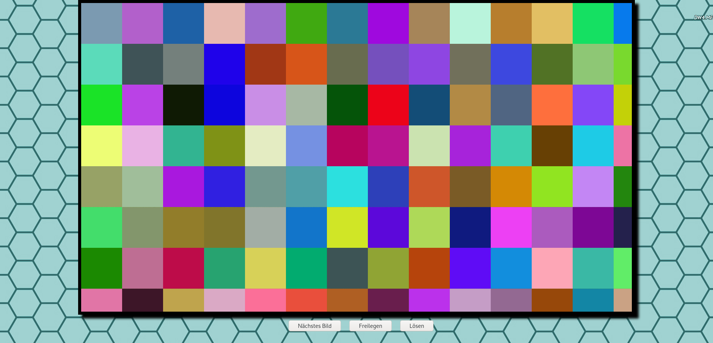
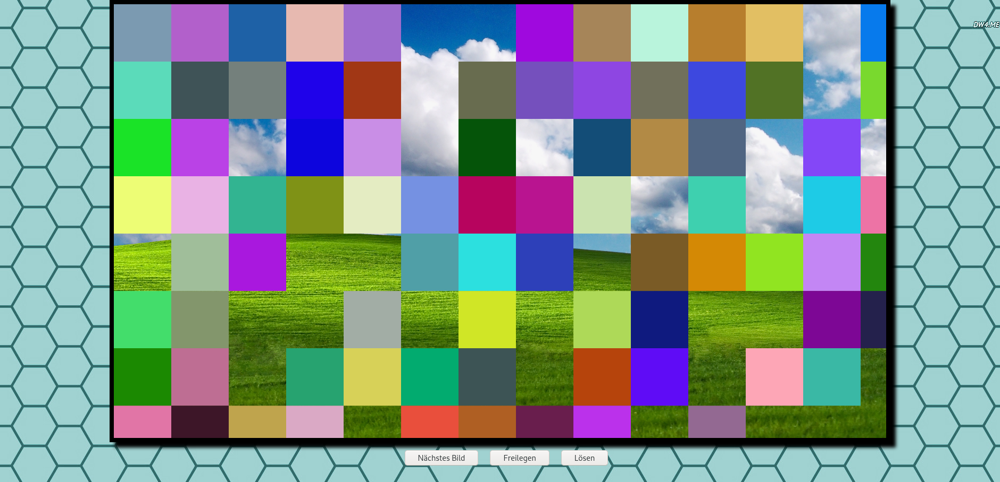
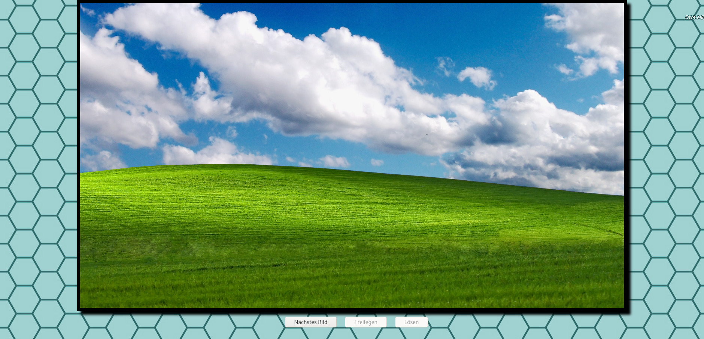

# Dalli-Klick
Ein schnell zusammen-gehacktes Dalli-Klick Spiel, das im Browser spielbar ist.   
Allerdings __ohne__ Punktesystem.

### Abhängigkeiten
- python3
- pip
- Web-Browser (optimiert für Firefox)

### Installation
```
git clone https://github.com/s-h-3-l-l/Dalli-Klick
cd Dalli-Klick
pip install -r requirements.txt
```

### Ausführen
Um das Dalli-Klick Spiel zu starten benötigt man ein Verzeichnis,
das die Bilder enthält, die erraten werden sollen.   
Zum Starten folgendes ausführen:
```
./main.py <VERZEICHNIS MIT BILDERN>
```
Danach ist das Spiel unter [http://127.0.0.1:5000](http://127.0.0.1:5000)
zu erreichen.

### Benutzen



Das Bild, das erraten werden muss befindet sich oben in dem schwarzen Kasten und ist mit bunten Quadraten überdeckt.
Darunter befinden sich drei Buttons.
Um nach und nach mehr vom Bild zu zeigen auf `Freilegen` drücken. Dies entfernt je ein farbiges Quadrat über dem Bild.   
Um alle Quadrate auf einmal zu entfernen auf `Lösen` drücken.    
Zum nächsten Bild kann man über den Button `Nächstes Bild` gelangen.
